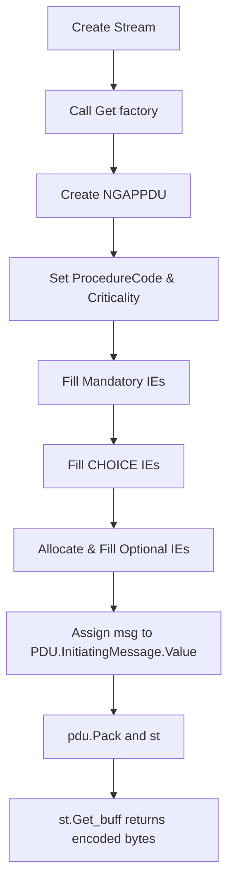
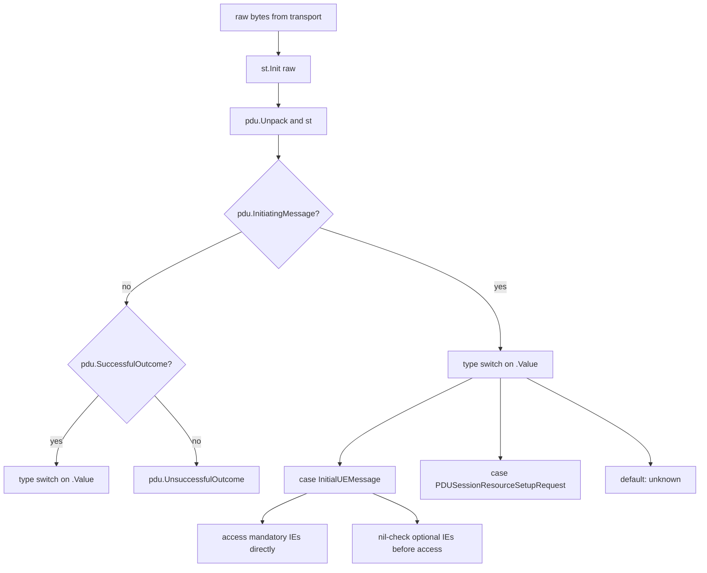

# go-asn1c — Commercial ASN.1 Integration Guide

> Copyright 2020 RideNext Software Solutions (I) Pvt. Ltd. Licensed under the Apache License, Version 2.0.  
> Contact: service@ridenext.co.in

---

## Table of Contents

1. [Overview](#1-overview)
2. [Prerequisites & System Requirements](#2-prerequisites--system-requirements)
3. [Build the Code Generator](#3-build-the-code-generator)
4. [Code Generation](#4-code-generation)
5. [Go Module Integration](#5-go-module-integration)
6. [Generated Type System](#6-generated-type-system)
7. [Encoding (Pack) — Step-by-Step](#7-encoding-pack--step-by-step)
8. [Decoding (Unpack) — Step-by-Step](#8-decoding-unpack--step-by-step)
9. [Nested OCTET STRING Decode (Inner PDU)](#9-nested-octet-string-decode-inner-pdu)
10. [Protocol Quick-Start Reference](#10-protocol-quick-start-reference)
11. [JSON Serialization](#11-json-serialization)
12. [Stream API Reference](#12-stream-api-reference)
13. [Error Handling & Troubleshooting](#13-error-handling--troubleshooting)
14. [Performance Considerations](#14-performance-considerations)
15. [Complete End-to-End Example](#15-complete-end-to-end-example)

---

## 1. Overview

`go-asn1c` is a code generator that converts ASN.1 specification files into production-ready Go source code. Given an ASN.1 file describing a telecom protocol (NGAP, F1AP, E2AP, S1AP, RRC, etc.), it produces:

- **Typed Go structs** for every ASN.1 type in the specification
- **`Pack` / `Unpack` methods** on every struct for binary encoding and decoding
- A **Stream engine** implementing the chosen encoding rule

### Two-Phase Model

```
ASN.1 File (.asn)
      │
      ▼
 [genasnpy — Python generator]
      │
      ├── protocols/<proto>/<ver>/asn1decode.go   ← Stream engine
      └── protocols/<proto>/<ver>/<proto>_pf.go   ← Structs + Pack/Unpack
                    │
                    ▼
         [Your Go application]
         import proto "ridenext.co.in/go-asn1/<proto>"
         pdu.Pack(&st)   /   pdu.Unpack(&st)
```

### Encoding Types

| Encoding | Flag   | Description                                      | Used For                          |
|----------|--------|--------------------------------------------------|-----------------------------------|
| PER      | `-t per`   | Packed Encoding Rules (aligned)              | NGAP, F1AP, E1AP, E2AP, S1AP, RANAP, HNBAP, M2AP, M3AP, XnAP, X2AP, E2SM |
| UAPER    | `-t uaper` | Unaligned PER (bit-level packing)            | RRC (NR and LTE)                  |

PER is the default when `-t` is omitted.

### Repository Layout

| Path            | Contents                                                      |
|-----------------|---------------------------------------------------------------|
| `asn1/`         | Input ASN.1 specification files (`<proto>-<version>.asn`)     |
| `libgo/`        | Go runtime/stream sources and per-protocol sample programs    |
| `hooks/`        | PyInstaller hooks for building the generator                  |
| `protocols/`    | Generated Go modules (`<proto>/<ver>/`); currently `ranap/f50` and `asn1/ngap/f50` |
| `dist/`         | Built `genasnpy` generator binary                             |
| `buildpyasn.sh` | Generates Go code for every `.asn` file under `asn1/`         |
| `genasnpy.spec` | PyInstaller spec for building the `genasnpy` binary           |
| `LICENSE`       | Apache License, Version 2.0                                   |

### Supported Protocols

| Protocol  | ASN.1 source files (`asn1/`)                                                                 | Encoding | Generated in `protocols/` |
|-----------|----------------------------------------------------------------------------------------------|----------|---------------------------|
| NGAP      | `ngap-f50.asn`                                                                               | PER      | `asn1/ngap/f50`           |
| RANAP     | `ranap-f50.asn`, `ranap-f15.asn`                                                             | PER      | `ranap/f50`               |
| F1AP      | `f1ap-f60.asn`                                                                               | PER      | -                         |
| E1AP      | `e1ap-f40.asn`                                                                               | PER      | -                         |
| E2AP      | `e2ap-v02.asn`, `e2ap-v02_01.asn`, `e2ap-v03_01.asn`                                         | PER      | -                         |
| E2SM-KPM  | `e2sm-kpm_v02.asn`, `_v02_01`, `_v03_01`, `_v03_05`                                          | PER      | -                         |
| E2SM-RC   | `e2sm-rc_v02.asn`, `_v02_01`, `_v04_00`, `_v06_00`                                           | PER      | -                         |
| S1AP      | `s1ap-f50.asn`                                                                               | PER      | -                         |
| X2AP      | `x2ap-f50.asn`                                                                               | PER      | -                         |
| XnAP      | `xnap-f30.asn`, `xnap-f40.asn`                                                               | PER      | -                         |
| HNBAP     | `hnbap-f50.asn`                                                                              | PER      | -                         |
| RUA       | `rua-f50.asn`                                                                                | PER      | -                         |
| M2AP      | `m2ap-f50.asn`                                                                               | PER      | -                         |
| M3AP      | `m3ap-f40.asn`, `m3ap-f50.asn`                                                               | PER      | -                         |
| RRC (LTE) | `rrc-f60.asn`                                                                                | UAPER    | -                         |
| RRC (NR)  | `rrc-5g_f51.asn`, `rrc-5g_f60.asn`                                                           | UAPER    | -                         |

Run `./buildpyasn.sh` to generate any protocol marked `-`.

---

## 2. Prerequisites & System Requirements

| Component  | Minimum Version | Purpose                                      |
|------------|-----------------|----------------------------------------------|
| Linux      | x86_64          | Supported OS                                 |
| Go         | 1.22            | Compile and run generated Go code            |
| Python     | 3.6             | Run the generator from source                |
| pyparsing  | 2.4+            | ASN.1 grammar parsing inside the generator  |
| pyinstaller| 4.0+            | Build the standalone `genasnpy` binary       |

> **Note:** If you use the pre-built `dist/genasnpy` binary, Python is **not** required on the target machine.

### Install Go 1.22+

```bash
curl -sL https://go.dev/dl/go1.22.5.linux-amd64.tar.gz -o /tmp/go.tar.gz
sudo tar -C /usr/local -xzf /tmp/go.tar.gz
echo 'export PATH=$PATH:/usr/local/go/bin' | sudo tee /etc/profile.d/go.sh
source /etc/profile.d/go.sh
go version
```

### Install Python 3 and Dependencies

```bash
sudo apt-get install -y python3 python3-pip   # Debian/Ubuntu
# or
sudo yum install -y python3 python3-pip       # RHEL/CentOS

pip3 install pyparsing pyinstaller
```

---

## 3. Build the Code Generator

### 3.1 Using the Pre-built Binary

A standalone binary is already provided at `dist/genasnpy`. It was built with PyInstaller and requires no Python installation on the target machine.

```bash
chmod +x dist/genasnpy

# Optional: install system-wide
sudo cp dist/genasnpy /usr/local/bin/genasnpy
```

Verify:

```bash
./dist/genasnpy -h
```

## 4. Code Generation

### 4.1 File Naming Convention

ASN.1 input files must be placed under the `asn1/` directory and named:

```
asn1/<protocol>-<version>.asn
```

| Example Filename         | Protocol | Version Meaning        |
|--------------------------|----------|------------------------|
| `ngap-f50.asn`           | NGAP     | 3GPP Rel-15 v5.0       |
| `f1ap-f60.asn`           | F1AP     | 3GPP Rel-16 v6.0       |
| `e2ap-v02_01.asn`        | E2AP     | O-RAN v2.01            |
| `e2sm-kpm_v03_05.asn`    | E2SM-KPM | O-RAN v3.05            |
| `rrc-5g_f60.asn`         | RRC-5G   | 3GPP Rel-16 v6.0       |

The generator derives the Go package name and output directory from the filename:
- Protocol name = part before the first `-`
- Version = part between `-` and `.asn`

### 4.2 Generator CLI Reference

```
./dist/genasnpy -i <inputfile> -t <per|uaper> [-p <prepend>]
```

| Flag | Long Form    | Required | Description                                                    |
|------|--------------|----------|----------------------------------------------------------------|
| `-i` | `--ifile`    | Yes      | Input ASN.1 filename (looked up under `asn1/`)                 |
| `-t` | `--type`     | No       | Encoding type: `per` (default) or `uaper`                      |
| `-p` | `--prepend`  | No       | Optional type name prefix string (rarely needed)               |
| `-h` |              | No       | Print usage and exit                                           |

**Encoding type selection by protocol:**

| Protocol          | Flag to use   |
|-------------------|---------------|
| NGAP, F1AP, E1AP  | `-t per`      |
| E2AP, E2SM-*      | `-t per`      |
| S1AP, RANAP       | `-t per`      |
| HNBAP, M2AP, M3AP | `-t per`      |
| XnAP, X2AP        | `-t per`      |
| RRC (NR / LTE)    | `-t uaper`    |

### 4.3 Single Protocol Generation

```bash
# NGAP Rel-15 (PER — default)
./dist/genasnpy -i ngap-f50.asn

# F1AP Rel-16 (PER explicit)
./dist/genasnpy -i f1ap-f60.asn -t per

# 5G RRC Rel-16 (UAPER)
./dist/genasnpy -i rrc-5g_f60.asn -t uaper

# E2AP with explicit prepend
./dist/genasnpy -i e2ap-v02_01.asn -t per -p e2ap
```

**Output directory structure** (example for NGAP):

```
protocols/ngap/f50/
├── go.mod          # module ridenext.co.in/go-asn1/ngap  go 1.22.5
├── asn1decode.go   # Stream engine (copied from libgo/perasn1decode.go, package ngap)
└── ngap_pf.go      # All generated structs + Pack/Unpack methods
```

| File            | Contents                                                                 |
|-----------------|--------------------------------------------------------------------------|
| `go.mod`        | Go module declaration, auto-created by `go mod init`                     |
| `asn1decode.go` | `Stream` struct, all base type encode/decode primitives, `HexBytes` type |
| `<proto>_pf.go` | Every ASN.1 type as a Go struct; `Pack`/`Unpack` on each; `Get*()` factories |

### 4.4 Bulk Generation (All Protocols)

`buildpyasn.sh` iterates every `.asn` file under `asn1/` and generates all protocols:

```bash
./buildpyasn.sh
```

**Special cases handled by the script:**

| Protocol | Behaviour                                  |
|----------|--------------------------------------------|
| `rrc`    | Uses `-t uaper` automatically              |
| `nas`    | Skipped (not yet supported)                |
| `pyint`  | Uses `-t per`; Python test files removed   |
| All others | Uses `-t per -p <proto>`               |

After generation, each protocol directory gets its own `go.mod` and a `cmd/` directory with a working example program.

---

## 5. Go Module Integration

### 5.1 Module Path Convention

Every generated library uses the module path:

```
ridenext.co.in/go-asn1/<protocol>
```

Examples:
- `ridenext.co.in/go-asn1/ngap`
- `ridenext.co.in/go-asn1/f1ap`
- `ridenext.co.in/go-asn1/e2ap`

### 5.2 Consumer `go.mod` Setup

Because the generated library is a local directory (not published to a registry), use a `replace` directive:

```
module your.company/your-app

go 1.22.5

require ridenext.co.in/go-asn1/ngap v0.0.0-00010101000000-000000000000

replace ridenext.co.in/go-asn1/ngap => ./protocols/ngap/f50/
```

Then resolve dependencies:

```bash
go mod tidy
```

This is exactly the pattern used in `protocols/ngap/cmd/go.mod`:

```
module ridenext.co.in/goasn1/test

go 1.22.5

replace ridenext.co.in/go-asn1/ngap => ../f50/

require ridenext.co.in/go-asn1/ngap v0.0.0-00010101000000-000000000000

require (
    github.com/sirupsen/logrus v1.9.4 // indirect
    golang.org/x/sys v0.13.0 // indirect
)
```

> **Note:** The generated `<proto>_pf.go` imports `github.com/sirupsen/logrus` for internal version logging. `go mod tidy` will pull it in automatically.

### 5.3 Import

```go
import ngap "ridenext.co.in/go-asn1/ngap"
```

Use a short alias matching the protocol name for readability.

---

## 6. Generated Type System

### 6.1 Base Types Reference

Every generated file includes these base types (defined in `asn1decode.go`):

| ASN.1 Type        | Go Type           | Key Fields                          | Notes                              |
|-------------------|-------------------|-------------------------------------|------------------------------------|
| `INTEGER`         | `INTEGER`         | `Value uint64`                      | Unsigned 64-bit                    |
| `BOOLEAN`         | `BOOLEAN`         | `Value bool`                        |                                    |
| `ENUMERATED`      | `ENUMERATED`      | `Value int`                         | Numeric index                      |
| `BIT STRING`      | `BITSTRING`       | `Value HexBytes; Len int`           | `Len` = number of significant bits |
| `OCTET STRING`    | `OCTETSTRING`     | `Value HexBytes; Item interface{}`  | `Item` for nested inner type       |
| `PrintableString` | `PRINTABLESTRING` | `Value string`                      |                                    |
| `NULL`            | `NULL`            | *(empty struct)*                    |                                    |
| `REAL`            | `REAL`            | `Value float64`                     |                                    |
| `OBJECT IDENTIFIER` | `OBJECTIDENTIFIER` | `Value string`                  | Dot-notation string                |
| *(byte slice)*    | `HexBytes`        | `[]byte`                            | JSON marshals as hex string        |

`HexBytes` has custom JSON marshalling — it serialises as a lowercase hex string (e.g. `"00f110"`) rather than base64. This applies to all `BITSTRING.Value` and `OCTETSTRING.Value` fields.

### 6.2 ASN.1 → Go Name Mapping Rules

The generator converts ASN.1 names to Go identifiers by:

1. Removing hyphens (`-`), underscores (`_`), and spaces
2. Applying CamelCase capitalisation

| ASN.1 Type  | ASN.1 Name              | Go Name              |
|-------------|-------------------------|----------------------|
| type        | `NR-CGI`                | `NRCGI`              |
| field       | `pLMNIdentity`          | `PLMNIdentity`       |
| enum value  | `Criticality : reject`  | `Criticalityreject`  |
| type        | `PDU-Session-ID`        | `PDUSessionID`       |
| field       | `rAN-UE-NGAP-ID`        | `RANUENGAPID`        |
| type        | `QosFlowSetupRequestItem` | `QosFlowSetupRequestItem` |

**Enum values** are named by concatenating the type name and the value name:
- `Criticality` + `reject` → `Criticalityreject`
- `Criticality` + `ignore` → `Criticalityignore`

**Package prefix:** All generated types are in the protocol package. Always qualify with the package alias:
```go
ngap.NRCGI
ngap.PLMNIdentity
ngap.Criticalityreject
```

### 6.3 SEQUENCE

A `SEQUENCE` becomes a Go struct. Each member maps to a field:

- **Mandatory member** → value type field
- **Optional member** → pointer type field (`*FieldType`); `nil` means absent

```go
// Mandatory: value type
msg.ProtocolIEs.RANUENGAPID.Value = 1000

// Optional: pointer type — nil = absent, &T{} = present
msg.ProtocolIEs.AMFSetID = &ngap.AMFSetID{}
msg.ProtocolIEs.AMFSetID.Value = []byte{0x10, 0xc0}
```

### 6.4 SEQUENCE OF

A `SEQUENCE OF` generates a wrapper struct with an `Items` slice:

```go
type QosFlowSetupRequestList struct {
    Items []QosFlowSetupRequestItem
}
```

Pre-allocate the slice before `Unpack` when inner items need their own pre-allocation:

```go
qfsri := make([]ngap.QosFlowSetupRequestItem, 1)
psr.ProtocolIEs.QosFlowSetupRequestList.Items = qfsri
```

### 6.5 CHOICE

A `CHOICE` generates a struct with one pointer field per alternative. Exactly one pointer must be non-nil:

```go
// Select the NR variant of UserLocationInformation
msg.ProtocolIEs.UserLocationInformation.UserLocationInformationNR = &ngap.UserLocationInformationNR{}
// All other alternatives remain nil (EUTRA, N3IWF, etc.)
```

After `Unpack`, check which alternative was decoded:

```go
if msg.ProtocolIEs.UserLocationInformation.UserLocationInformationNR != nil {
    // NR location
} else if msg.ProtocolIEs.UserLocationInformation.UserLocationInformationEUTRA != nil {
    // EUTRA location
}
```

### 6.6 OCTET STRING with Inner Type

Some IEs carry a fully encoded inner message inside an `OCTET STRING` (e.g. `PDUSessionResourceSetupRequestTransfer`). The `OCTETSTRING` struct has an `Item interface{}` field for this purpose.

**You must pre-allocate the inner struct and assign it to `Item` before calling `Unpack` on the outer PDU.** If `Item` is nil, the inner bytes are stored in `Value` but not decoded.

```go
// Pre-allocate inner type
psr := &ngap.PDUSessionResourceSetupRequestTransfer{}

// Pre-allocate inner CHOICE and SEQUENCE OF within the inner type
d5qi := &ngap.Dynamic5QIDescriptor{}
qfsri := make([]ngap.QosFlowSetupRequestItem, 1)
qfsri[0].QosFlowLevelQosParameters.QosCharacteristics.Dynamic5QI = d5qi
psr.ProtocolIEs.QosFlowSetupRequestList.Items = qfsri

// Assign to the outer IE before Unpack
pdutype.ProtocolIEs.PDUSessionResourceSetupListSUReq.Items[0].
    PDUSessionResourceSetupRequestTransfer.Item = psr
```

### 6.7 Object Sets — PDU Factory Functions

For every message type, the generator produces a factory function:

```
Get<MessageName><MessageType>() (*MessageType, procedureCode, criticality)
```

This returns a pre-wired message struct along with the correct procedure code and criticality values for the PDU wrapper. Always use this factory — do not construct the procedure code and criticality manually.

```go
msg, procedure, criticality := ngap.GetInitialUEMessageINITIATINGMESSAGE()
```

---

## 7. Encoding (Pack) — Step-by-Step

### 7.1 Workflow Overview



### 7.2 Create a Stream

```go
st := ngap.Stream{}
// No Init needed for encoding — the buffer grows automatically
```

### 7.3 Get Message Factory

```go
msg, procedure, criticality := ngap.GetInitialUEMessageINITIATINGMESSAGE()
```

`msg` is a `*ngap.InitialUEMessage` with all fields at zero values, ready to be populated.

### 7.4 Build the PDU Wrapper

```go
pdu := ngap.NGAPPDU{}
pdu.InitiatingMessage = &ngap.InitiatingMessage{}
pdu.InitiatingMessage.ProcedureCode = ngap.NGAPELEMENTARYPROCEDUREprocedureCode{procedure}
pdu.InitiatingMessage.Criticality   = ngap.NGAPELEMENTARYPROCEDUREcriticality{criticality}
```

### 7.5 Fill Mandatory IEs

Mandatory IEs are value-type fields — assign directly:

```go
msg.ProtocolIEs.RANUENGAPID.Value = 1000
msg.ProtocolIEs.NASPDU.Value      = []byte{0x7e, 0x05, 0x05}
```

### 7.6 Fill CHOICE IEs

Allocate the chosen alternative pointer; leave all others nil:

```go
msg.ProtocolIEs.UserLocationInformation.UserLocationInformationNR = &ngap.UserLocationInformationNR{}

loc := msg.ProtocolIEs.UserLocationInformation.UserLocationInformationNR
loc.NRCGI.PLMNIdentity.Value    = []byte{0x00, 0xf1, 0x10}
loc.NRCGI.NRCellIdentity.Len   = 22
loc.NRCGI.NRCellIdentity.Value = []byte{0x11, 0x22, 0x33, 0x44, 0x55}
loc.TAI.PLMNIdentity.Value     = []byte{0x00, 0xf1, 0x10}
loc.TAI.TAC.Value              = []byte{0xab, 0xcd, 0xef}
```

### 7.7 Fill Optional IEs

Allocate the pointer to include the IE; leave nil to omit:

```go
// Include AMFSetID
msg.ProtocolIEs.AMFSetID = &ngap.AMFSetID{}
msg.ProtocolIEs.AMFSetID.Value = []byte{0x10, 0xc0}

// Include UEContextRequest
msg.ProtocolIEs.UEContextRequest = &ngap.UEContextRequest{}
msg.ProtocolIEs.UEContextRequest.Value = 5

// Omit FiveGSTMSI — leave as nil (default zero value)
```

### 7.8 Encode and Extract Bytes

```go
pdu.InitiatingMessage.Value = msg
pdu.Pack(&st)
encodedBytes := st.Get_buff()   // []byte — ready to send over transport
```

### 7.9 Complete InitialUEMessage Encode Example

```go
func buildInitialUEMessage(ngapId uint64, nasBuff []byte) []byte {
    st := ngap.Stream{}

    msg, procedure, criticality := ngap.GetInitialUEMessageINITIATINGMESSAGE()

    pdu := ngap.NGAPPDU{}
    pdu.InitiatingMessage = &ngap.InitiatingMessage{}
    pdu.InitiatingMessage.ProcedureCode = ngap.NGAPELEMENTARYPROCEDUREprocedureCode{procedure}
    pdu.InitiatingMessage.Criticality   = ngap.NGAPELEMENTARYPROCEDUREcriticality{criticality}

    // Mandatory IEs
    msg.ProtocolIEs.RANUENGAPID.Value = ngapId
    msg.ProtocolIEs.NASPDU.Value      = nasBuff

    // Mandatory CHOICE IE — NR location
    msg.ProtocolIEs.UserLocationInformation.UserLocationInformationNR = &ngap.UserLocationInformationNR{}
    loc := msg.ProtocolIEs.UserLocationInformation.UserLocationInformationNR
    loc.NRCGI.PLMNIdentity.Value    = []byte{0x00, 0xf1, 0x10}
    loc.NRCGI.NRCellIdentity.Len   = 22
    loc.NRCGI.NRCellIdentity.Value = []byte{0x11, 0x22, 0x33, 0x44, 0x55}
    loc.TAI.PLMNIdentity.Value     = []byte{0x00, 0xf1, 0x10}
    loc.TAI.TAC.Value              = []byte{0xab, 0xcd, 0xef}

    // Optional IEs
    msg.ProtocolIEs.AMFSetID = &ngap.AMFSetID{}
    msg.ProtocolIEs.AMFSetID.Value = []byte{0x10, 0xc0}
    msg.ProtocolIEs.UEContextRequest = &ngap.UEContextRequest{}
    msg.ProtocolIEs.UEContextRequest.Value = 5

    pdu.InitiatingMessage.Value = msg
    pdu.Pack(&st)
    return st.Get_buff()
}
```

---

## 8. Decoding (Unpack) — Step-by-Step

### 8.1 Workflow Overview



### 8.2 Initialize Stream

```go
st := ngap.Stream{}
st.Init(rawBytes)   // rawBytes is the []byte received from transport
```

### 8.3 Unpack PDU

```go
pdu := ngap.NGAPPDU{}
pdu.Unpack(&st)
```

### 8.4 Dispatch on Message Type

The top-level PDU has three possible message containers. Check which one is populated:

```go
switch {
case pdu.InitiatingMessage != nil:
    // handle initiating messages
case pdu.SuccessfulOutcome != nil:
    // handle successful responses
case pdu.UnsuccessfulOutcome != nil:
    // handle failure responses
}
```

Within each container, use a type switch on `.Value`:

```go
switch msg := pdu.InitiatingMessage.Value.(type) {
case *ngap.InitialUEMessage:
    handleInitialUE(msg)
case *ngap.PDUSessionResourceSetupRequest:
    handlePDUSessionSetup(msg)
default:
    return fmt.Errorf("unhandled initiating message: %T", msg)
}
```

### 8.5 Handle InitiatingMessage / SuccessfulOutcome / UnsuccessfulOutcome

```go
// Initiating message
switch msg := pdu.InitiatingMessage.Value.(type) {
case *ngap.InitialUEMessage:
    // ...
}

// Successful outcome
switch msg := pdu.SuccessfulOutcome.Value.(type) {
case *ngap.NGSetupResponse:
    // ...
}

// Unsuccessful outcome
switch msg := pdu.UnsuccessfulOutcome.Value.(type) {
case *ngap.NGSetupFailure:
    // ...
}
```

### 8.6 Access Mandatory IEs

Mandatory IEs are value types — access directly without nil checks:

```go
ranUeNgapId := msg.ProtocolIEs.RANUENGAPID.Value   // uint64
nasPdu      := msg.ProtocolIEs.NASPDU.Value         // []byte
```

### 8.7 Access Optional IEs (nil-check pattern)

Optional IEs are pointer types. Always nil-check before access:

```go
if msg.ProtocolIEs.AMFSetID != nil {
    amfSetId := msg.ProtocolIEs.AMFSetID.Value
    _ = amfSetId
}

if msg.ProtocolIEs.UserLocationInformation.UserLocationInformationNR != nil {
    plmn := msg.ProtocolIEs.UserLocationInformation.UserLocationInformationNR.NRCGI.PLMNIdentity.Value
    _ = plmn
}
```

### 8.8 Re-decode with Reset()

To decode the same buffer again (e.g. after a Pack round-trip), call `Reset()` to rewind the stream position:

```go
pdu.Pack(&st1)
st1.Reset()           // rewind to position 0
pdu.Unpack(&st1)      // decode the just-encoded bytes
```

### 8.9 Complete Decode Example

```go
func decodeNGAP(raw []byte) error {
    st := ngap.Stream{}
    st.Init(raw)

    pdu := ngap.NGAPPDU{}
    pdu.Unpack(&st)

    if pdu.InitiatingMessage == nil {
        return fmt.Errorf("not an initiating message")
    }

    switch msg := pdu.InitiatingMessage.Value.(type) {
    case *ngap.InitialUEMessage:
        ranUeId := msg.ProtocolIEs.RANUENGAPID.Value
        nasPdu  := msg.ProtocolIEs.NASPDU.Value
        fmt.Printf("RAN-UE-NGAP-ID: %d\n", ranUeId)
        fmt.Printf("NAS-PDU: %x\n", nasPdu)

        // Optional IE
        if msg.ProtocolIEs.UserLocationInformation.UserLocationInformationNR != nil {
            loc := msg.ProtocolIEs.UserLocationInformation.UserLocationInformationNR
            fmt.Printf("PLMN: %x\n", loc.NRCGI.PLMNIdentity.Value)
        }

    case *ngap.PDUSessionResourceSetupRequest:
        fmt.Printf("PDU Session Resource Setup Request received\n")

    default:
        return fmt.Errorf("unknown initiating message type: %T", msg)
    }
    return nil
}
```

---

## 9. Nested OCTET STRING Decode (Inner PDU)

### 9.1 Why It Exists

In 3GPP protocols, some IEs carry a fully encoded inner message inside an `OCTET STRING` container (e.g. `PDUSessionResourceSetupRequestTransfer` inside `PDUSessionResourceSetupRequest`). The outer decoder cannot know the inner type at compile time, so the `OCTETSTRING` struct provides an `Item interface{}` field for the caller to supply the target struct before decoding.

If `Item` is `nil` when `Unpack` runs, the raw bytes are stored in `Value` but the inner message is not decoded.

### 9.2 Pre-allocation Pattern

```go
// 1. Allocate the inner struct
psr := &ngap.PDUSessionResourceSetupRequestTransfer{}

// 2. Pre-allocate any nested CHOICE or SEQUENCE OF within the inner struct
d5qi := &ngap.Dynamic5QIDescriptor{}
qfsri := make([]ngap.QosFlowSetupRequestItem, 1)
qfsri[0].QosFlowLevelQosParameters.QosCharacteristics.Dynamic5QI = d5qi
psr.ProtocolIEs.QosFlowSetupRequestList.Items = qfsri

// 3. Assign to the outer IE's Item field BEFORE calling Unpack on the outer PDU
pdutype.ProtocolIEs.PDUSessionResourceSetupListSUReq.Items[0].
    PDUSessionResourceSetupRequestTransfer.Item = psr

// 4. Now Unpack the outer PDU — the inner bytes will be decoded into psr
pdu.Unpack(&st)
```

### 9.3 Full Example (from protocols/ngap/cmd/ngap.go)

```go
msg, _ := hex.DecodeString("001d005e000004000a00032003e8005500020000002600403f2e0506c2110014050011223d01013d09110101010101010101220906040001040001290501c00000022514134f70656e52616469737973496e7465726e6574004a0006000001000000")

st := ngap.Stream{}
st.Init(msg)

// Pre-allocate inner transfer struct
psr := &ngap.PDUSessionResourceSetupRequestTransfer{}
d5qi := &ngap.Dynamic5QIDescriptor{}
qfsri := make([]ngap.QosFlowSetupRequestItem, 1)
qfsri[0].QosFlowLevelQosParameters.QosCharacteristics.Dynamic5QI = d5qi
psr.ProtocolIEs.QosFlowSetupRequestList.Items = qfsri

pdu := ngap.NGAPPDU{}
pdu.Unpack(&st)

switch pdutype := pdu.InitiatingMessage.Value.(type) {
case *ngap.PDUSessionResourceSetupRequest:
    pdutype.ProtocolIEs.PDUSessionResourceSetupListSUReq.Items[0].
        PDUSessionResourceSetupRequestTransfer.Item = psr
    fmt.Printf("Transfer: %+v\n", psr)
default:
    fmt.Printf("other: %T\n", pdutype)
}
```

### 9.4 General Pattern for Any Protocol

Any `OCTETSTRING` field that carries an inner encoded message follows the same pattern:

1. Identify the IE whose Go type is `OCTETSTRING` and has a known inner ASN.1 type.
2. Allocate the inner Go struct (and any nested structs it requires).
3. Assign the pointer to `<outerIE>.Item` before calling `Unpack`.
4. After `Unpack`, cast `<outerIE>.Item` back to the concrete type to access fields.

---

## 10. Protocol Quick-Start Reference

For each protocol: the ASN.1 source file, Go module path, PDU type name, encoding type, and a minimal decode snippet.

---

### 10.1 NGAP (Next Generation Application Protocol)

| Item         | Value                                  |
|--------------|----------------------------------------|
| ASN.1 file   | `asn1/ngap-f50.asn`                    |
| Module       | `ridenext.co.in/go-asn1/ngap`          |
| PDU type     | `ngap.NGAPPDU`                         |
| Encoding     | PER                                    |

```go
import ngap "ridenext.co.in/go-asn1/ngap"

st := ngap.Stream{}
st.Init(raw)
pdu := ngap.NGAPPDU{}
pdu.Unpack(&st)
```

---

### 10.2 F1AP (F1 Application Protocol)

| Item         | Value                                  |
|--------------|----------------------------------------|
| ASN.1 file   | `asn1/f1ap-f60.asn`                    |
| Module       | `ridenext.co.in/go-asn1/f1ap`          |
| PDU type     | `f1ap.F1APPDU`                         |
| Encoding     | PER                                    |

```go
import f1ap "ridenext.co.in/go-asn1/f1ap"

// Decode
st := f1ap.Stream{}
st.Init(raw)
pdu := f1ap.F1APPDU{}
pdu.Unpack(&st)

// Encode
st1 := f1ap.Stream{}
pdu.Pack(&st1)
encoded := st1.Get_buff()
```

---

### 10.3 E1AP (E1 Application Protocol)

| Item         | Value                                  |
|--------------|----------------------------------------|
| ASN.1 file   | `asn1/e1ap-f40.asn`                    |
| Module       | `ridenext.co.in/go-asn1/e1ap`          |
| PDU type     | `e1ap.E1APPDU`                         |
| Encoding     | PER                                    |

```go
import e1ap "ridenext.co.in/go-asn1/e1ap"

st := e1ap.Stream{}
st.Init(raw)
pdu := e1ap.E1APPDU{}
pdu.Unpack(&st)
```

---

### 10.4 E2AP (E2 Application Protocol)

| Item         | Value                                                        |
|--------------|--------------------------------------------------------------|
| ASN.1 files  | `asn1/e2ap-v02_01.asn`, `asn1/e2ap-v03_01.asn`              |
| Module       | `ridenext.co.in/go-asn1/e2ap`                                |
| PDU type     | `e2ap.E2APPDU`                                               |
| Encoding     | PER                                                          |

```go
import e2ap "ridenext.co.in/go-asn1/e2ap"

// Subscription Request example
msgSR, _ := hex.DecodeString("0008004b000003001d00050000030d4000050002000d001e0035001b18000300000020000000000120000100000220000200000320000300001340134001000f00010400000210012b10012c10018f00")
st := e2ap.Stream{}
st.Init(msgSR)
pdu := e2ap.E2APPDU{}
pdu.Unpack(&st)
```

---

### 10.5 E2SM-KPM (E2 Service Model — KPM)

| Item         | Value                                                              |
|--------------|--------------------------------------------------------------------|
| ASN.1 files  | `asn1/e2sm-kpm_v02_01.asn`, `asn1/e2sm-kpm_v03_05.asn`           |
| Module       | `ridenext.co.in/go-asn1/e2sm`                                      |
| PDU type     | `e2sm.E2SMPDU`                                                     |
| Encoding     | PER                                                                |

```go
import e2sm "ridenext.co.in/go-asn1/e2sm"

st := e2sm.Stream{}
st.Init(raw)
pdu := e2sm.E2SMPDU{}
pdu.Unpack(&st)
```

---

### 10.6 E2SM-RC (E2 Service Model — RAN Control)

| Item         | Value                                                              |
|--------------|--------------------------------------------------------------------|
| ASN.1 files  | `asn1/e2sm-rc_v02_01.asn`, `asn1/e2sm-rc_v06_00.asn`             |
| Module       | `ridenext.co.in/go-asn1/e2sm_rc`                                   |
| PDU type     | `e2sm_rc.E2SMPDU`                                                  |
| Encoding     | PER                                                                |

```go
import e2smrc "ridenext.co.in/go-asn1/e2sm_rc"

st := e2smrc.Stream{}
st.Init(raw)
pdu := e2smrc.E2SMPDU{}
pdu.Unpack(&st)
```

---

### 10.7 S1AP (S1 Application Protocol — LTE)

| Item         | Value                                  |
|--------------|----------------------------------------|
| ASN.1 file   | `asn1/s1ap-f50.asn`                    |
| Module       | `ridenext.co.in/go-asn1/s1ap`          |
| PDU type     | `s1ap.S1APPDU`                         |
| Encoding     | PER                                    |

```go
import s1ap "ridenext.co.in/go-asn1/s1ap"

msg, _ := hex.DecodeString("000900809d00000600000002000100080002000c0042000a1805f5e1006002faf080...")
st := s1ap.Stream{}
st.Init(msg)
pdu := s1ap.S1APPDU{}
pdu.Unpack(&st)
```

---

### 10.8 RANAP (Radio Access Network Application Protocol — 3G)

| Item         | Value                                  |
|--------------|----------------------------------------|
| ASN.1 file   | `asn1/ranap-f50.asn`                   |
| Module       | `ridenext.co.in/go-asn1/ranap`         |
| PDU type     | `ranap.RANAPDU`                        |
| Encoding     | PER                                    |

```go
import ranap "ridenext.co.in/go-asn1/ranap"

st := ranap.Stream{}
st.Init(raw)
pdu := ranap.RANAPDU{}
pdu.Unpack(&st)
```

---

### 10.9 RRC-5G (Radio Resource Control — NR)

| Item         | Value                                  |
|--------------|----------------------------------------|
| ASN.1 file   | `asn1/rrc-5g_f60.asn`                  |
| Module       | `ridenext.co.in/go-asn1/rrc`           |
| PDU type     | `rrc.RRCPDU`                           |
| Encoding     | **UAPER** (generate with `-t uaper`)   |

```go
import rrc "ridenext.co.in/go-asn1/rrc"

msg, _ := hex.DecodeString("13102000005df80105e400340593d8a4000000004000004440b80b838000")
st := rrc.Stream{}
st.Init(msg)
pdu := rrc.RRCPDU{}
pdu.Unpack(&st)
```

> **Important:** RRC uses UAPER. The library must be generated with `./dist/genasnpy -i rrc-5g_f60.asn -t uaper`. Using PER will produce incorrect results.

---

### 10.10 HNBAP (Home NodeB Application Protocol)

| Item         | Value                                  |
|--------------|----------------------------------------|
| ASN.1 file   | `asn1/hnbap-f50.asn`                   |
| Module       | `ridenext.co.in/go-asn1/hnbap`         |
| PDU type     | `hnbap.HNBAPPDU`                       |
| Encoding     | PER                                    |

```go
import hnbap "ridenext.co.in/go-asn1/hnbap"

st := hnbap.Stream{}
st.Init(raw)
pdu := hnbap.HNBAPPDU{}
pdu.Unpack(&st)
```

---

### 10.11 M2AP

| Item         | Value                                  |
|--------------|----------------------------------------|
| ASN.1 file   | `asn1/m2ap-f50.asn`                    |
| Module       | `ridenext.co.in/go-asn1/m2ap`          |
| PDU type     | `m2ap.M2APPDU`                         |
| Encoding     | PER                                    |

```go
import m2ap "ridenext.co.in/go-asn1/m2ap"

st := m2ap.Stream{}
st.Init(raw)
pdu := m2ap.M2APPDU{}
pdu.Unpack(&st)
```

---

### 10.12 M3AP

| Item         | Value                                  |
|--------------|----------------------------------------|
| ASN.1 files  | `asn1/m3ap-f40.asn`, `asn1/m3ap-f50.asn` |
| Module       | `ridenext.co.in/go-asn1/m3ap`          |
| PDU type     | `m3ap.M3APPDU`                         |
| Encoding     | PER                                    |

```go
import m3ap "ridenext.co.in/go-asn1/m3ap"

st := m3ap.Stream{}
st.Init(raw)
pdu := m3ap.M3APPDU{}
pdu.Unpack(&st)
```

---

### 10.13 XnAP (Xn Application Protocol)

| Item         | Value                                  |
|--------------|----------------------------------------|
| ASN.1 files  | `asn1/xnap-f30.asn`, `asn1/xnap-f40.asn` |
| Module       | `ridenext.co.in/go-asn1/xnap`          |
| PDU type     | `xnap.XnAPPDU`                         |
| Encoding     | PER                                    |

```go
import xnap "ridenext.co.in/go-asn1/xnap"

st := xnap.Stream{}
st.Init(raw)
pdu := xnap.XnAPPDU{}
pdu.Unpack(&st)
```

---

### 10.14 X2AP (X2 Application Protocol — LTE)

| Item         | Value                                  |
|--------------|----------------------------------------|
| ASN.1 file   | `asn1/x2ap-f50.asn`                    |
| Module       | `ridenext.co.in/go-asn1/x2ap`          |
| PDU type     | `x2ap.X2APPDU`                         |
| Encoding     | PER                                    |

```go
import x2ap "ridenext.co.in/go-asn1/x2ap"

st := x2ap.Stream{}
st.Init(raw)
pdu := x2ap.X2APPDU{}
pdu.Unpack(&st)
```

---

## 11. JSON Serialization

All generated structs support `encoding/json` out of the box.

### 11.1 Marshal a PDU to JSON

```go
import "encoding/json"

jsonData, err := json.Marshal(pdu)
if err != nil {
    log.Fatal(err)
}
fmt.Printf("%s\n", jsonData)
```

### 11.2 HexBytes — Hex String Encoding

The `HexBytes` type (used for `BITSTRING.Value` and `OCTETSTRING.Value`) marshals as a **lowercase hex string**, not base64. This is implemented via custom `MarshalJSON` / `UnmarshalJSON` methods in `asn1decode.go`:

```go
// MarshalJSON: []byte{0x00, 0xf1, 0x10} → "00f110"
// UnmarshalJSON: "00f110" → []byte{0x00, 0xf1, 0x10}
```

Example JSON output for an NGAP InitialUEMessage:

```json
{
  "InitiatingMessage": {
    "ProcedureCode": {"Value": 18},
    "Criticality": {"Value": 0},
    "Value": {
      "ProtocolIEs": {
        "RANUENGAPID": {"Value": 1000},
        "NASPDU": {"Value": "7e0505"},
        "UserLocationInformation": {
          "UserLocationInformationNR": {
            "NRCGI": {
              "PLMNIdentity": {"Value": "00f110"},
              "NRCellIdentity": {"Value": "1122334455", "Len": 22}
            },
            "TAI": {
              "PLMNIdentity": {"Value": "00f110"},
              "TAC": {"Value": "abcdef"}
            }
          }
        },
        "AMFSetID": {"Value": "10c0"},
        "UEContextRequest": {"Value": 5}
      }
    }
  }
}
```

### 11.3 JSON Round-Trip

```go
// Marshal
data, _ := json.Marshal(pdu)

// Unmarshal back
var pdu2 ngap.NGAPPDU
json.Unmarshal(data, &pdu2)
```

> **Performance note:** JSON marshalling of large PDUs (e.g. E2SM-RC with many IEs) is expensive. Use it for logging and debugging only — not on the critical encode/decode path. See Section 14.5.

---

## 12. Stream API Reference

The `Stream` struct is the core encode/decode engine. It is defined in the generated `asn1decode.go` file within each protocol package.

### 12.1 Public API

| Method / Usage              | Signature                        | Description                                                    |
|-----------------------------|----------------------------------|----------------------------------------------------------------|
| `st.Init(buf)`              | `Init(buff []byte)`              | Initialize stream for **decoding** from an existing byte slice. Sets position to 0. |
| `st.Reset()`                | `Reset()`                        | Reset stream position to byte 0, bit 0. Use to re-encode or re-decode. |
| `st.Get_buff()`             | `Get_buff() []byte`              | Return the encoded bytes after `Pack`. Returns `buff[:c_ind]`. |
| `st.dumpInfo(prompt)`       | `dumpInfo(prompt string)`        | Print current stream position and byte value — for debugging.  |
| `pdu.Pack(&st)`             | Method on PDU struct             | Encode the PDU into the stream. Buffer grows automatically.    |
| `pdu.Unpack(&st)`           | Method on PDU struct             | Decode the PDU from the stream. Stream must be initialised with `Init`. |

### 12.2 Stream Internal State

```go
type Stream struct {
    buff  []byte  // encode/decode buffer
    c_ind int     // current byte index
    c_bit int     // current bit index within the byte (0–7)
}
```

### 12.3 Advanced / Internal Methods (for extension)

These are used internally by generated `Pack`/`Unpack` code. You do not need to call them directly unless extending the engine.

| Method                  | Description                                              |
|-------------------------|----------------------------------------------------------|
| `get_bits(n)`           | Read `n` bits from stream                                |
| `set_bits(val, n)`      | Write `n` bits to stream                                 |
| `get_byte()`            | Read one full byte                                       |
| `parse_len(size)`       | Read a PER length determinant                            |
| `format_len(val, size)` | Write a PER length determinant                           |
| `get_listsize(max)`     | Read a constrained list size                             |
| `get_choice(bits)`      | Read a CHOICE index                                      |
| `get_flags(bits)`       | Read optional-IE presence bitmap                         |
| `reserve_len()`         | Reserve a length field position (returns location)       |
| `set_len(loc)`          | Back-fill a reserved length field                        |
| `reserve_flags(sz)`     | Reserve a flags bitmap position                          |
| `set_flags(v, loc, sz)` | Back-fill a reserved flags bitmap                        |
| `reset_bits()`          | Align to next byte boundary                              |
| `parse_ext()`           | Read the ASN.1 extension marker bit                      |
| `format_ext(val)`       | Write the ASN.1 extension marker bit                     |

---

## 13. Error Handling & Troubleshooting

### 13.1 Error Types

The generator (`genasnpy.py`) uses the following exception hierarchy from `asn_errors.py`:

| Exception           | When raised                                              |
|---------------------|----------------------------------------------------------|
| `CompileError`      | ASN.1 file cannot be parsed or compiled                  |
| `EncodeError`       | A value cannot be encoded (constraint violation, etc.)   |
| `DecodeError`       | A byte stream cannot be decoded                          |
| `ConstraintsError`  | A value violates an ASN.1 constraint (range, size, etc.) |

These are Python exceptions raised during code generation, not at Go runtime.

### 13.2 Panic Recovery at Go Runtime

The Go `Unpack` functions can panic on malformed input (e.g. truncated buffers, out-of-range indices). Wrap `Unpack` calls in a `recover()` for production use:

```go
func safeUnpack(raw []byte) (pdu ngap.NGAPPDU, err error) {
    defer func() {
        if r := recover(); r != nil {
            err = fmt.Errorf("decode panic: %v", r)
        }
    }()
    st := ngap.Stream{}
    st.Init(raw)
    pdu.Unpack(&st)
    return pdu, nil
}
```

### 13.3 Common Mistakes & Fixes

| Symptom                                      | Cause                                              | Fix                                                          |
|----------------------------------------------|----------------------------------------------------|--------------------------------------------------------------|
| `nil pointer dereference` on optional IE     | Accessing pointer IE without nil check             | Always `if msg.ProtocolIEs.X != nil` before accessing        |
| Decoded fields all zero / wrong values       | PER library used for RRC message                   | Regenerate RRC with `-t uaper`                               |
| Inner OCTET STRING fields not populated      | `Item` not pre-allocated before `Unpack`           | Assign inner struct pointer to `Item` before `Unpack`        |
| `go mod tidy` fails with "no required module"| Missing `replace` directive in `go.mod`            | Add `replace ridenext.co.in/go-asn1/<proto> => ./protocols/<proto>/<ver>/` |
| Generator exits: `list index out of range`   | ASN.1 file not found in `asn1/` directory          | Place the `.asn` file under `asn1/` before running generator |
| Generator exits: `KeyError` on type name     | Filename does not follow `<proto>-<ver>.asn` format| Rename file to match convention                              |
| CHOICE field nil after decode                | Decoded alternative not the one you checked        | Check all alternative pointer fields, not just one           |
| `Pack` produces empty buffer                 | `pdu.InitiatingMessage.Value` not assigned         | Set `pdu.InitiatingMessage.Value = msg` before `Pack`        |
| `go build` fails: `undefined: logrus`        | `go mod tidy` not run after generation             | Run `go mod tidy` in the consumer module directory           |

### 13.4 Generator Troubleshooting

**File location:** The generator looks for input files under `asn1/` relative to the working directory. Always run from the `goasn1c` project root:

```bash
cd /path/to/goasn1c
./dist/genasnpy -i ngap-f50.asn
```

**Filename convention:** The filename must be `<protocol>-<version>.asn`. The generator splits on `-` to derive the package name and output path. A filename like `ngap_f50.asn` or `ngap.asn` will fail.

**Python version:** The generator source requires Python 3.6+. The pre-built `dist/genasnpy` binary requires no Python.

**Regenerating after ASN.1 changes:** Simply re-run the generator. It overwrites the output files. The `go.mod` in the output directory is only created if it does not already exist (`go mod init` is idempotent).

---

## 14. Performance Considerations

### 14.1 Stream Buffer Allocation

During `Pack`, the `Stream` buffer grows dynamically via Go's `append` in `write_bit`:

```go
if len(s.buff) <= s.c_ind {
    s.buff = append(s.buff, []byte{0, 0, 0, 0}...)
}
```

Each `append` may trigger a heap allocation and copy. For high-throughput encoding:

- **Pre-warm the buffer** by encoding one message and retaining the `Stream` — subsequent encodes of similar-sized messages will reuse the already-allocated backing array after `Reset()`.
- **Avoid creating a new `Stream{}` per message** in hot paths. Reuse via `sync.Pool` (see 14.4).

### 14.2 Stream Reuse with Reset()

`Reset()` rewinds `c_ind` and `c_bit` to zero without releasing the buffer:

```go
// Encode first message
pdu1.Pack(&st)
buf1 := make([]byte, len(st.Get_buff()))
copy(buf1, st.Get_buff())   // copy out before reset

// Reuse stream for second message
st.Reset()
pdu2.Pack(&st)
buf2 := st.Get_buff()
```

For decode, `Reset()` allows re-parsing the same buffer:

```go
pdu.Pack(&st)
st.Reset()
pdu.Unpack(&st)   // decode the just-encoded bytes
```

> **Do NOT share a `Stream` across goroutines.** It has no internal synchronisation. Each goroutine must own its own `Stream` instance.

### 14.3 Avoiding Allocations on the Decode Path

The following allocations are unavoidable per the PER specification:

- `OCTETSTRING.Value` — `parsef_OctString` uses `make([]byte, size)` + `copy`
- `BITSTRING.Value` — `parsef_BitString` uses `make([]byte, sz)`

For high-throughput decode pipelines, reduce GC pressure by:

1. Pooling top-level PDU structs (see 14.4)
2. Processing decoded values immediately and discarding the PDU struct before the next decode
3. Avoiding `json.Marshal` on the critical path (see 14.5)

### 14.4 sync.Pool Pattern for Stream Reuse

```go
var streamPool = sync.Pool{
    New: func() interface{} { return &ngap.Stream{} },
}

func decodeWithPool(raw []byte) (ngap.NGAPPDU, error) {
    st := streamPool.Get().(*ngap.Stream)
    defer func() {
        st.Reset()
        streamPool.Put(st)
    }()

    st.Init(raw)
    pdu := ngap.NGAPPDU{}
    pdu.Unpack(st)
    return pdu, nil
}
```

You can apply the same pattern to PDU structs if profiling shows struct allocation is a bottleneck, but note that PDU structs contain pointer fields that must be re-zeroed between uses.

### 14.5 JSON Overhead

`json.Marshal` on a large PDU (e.g. E2SM-RC with many IEs, or an S1AP Initial Context Setup Request) involves reflection over every field and hex-encoding of every `HexBytes` value. This is expensive.

**Recommendation:**

- Use `json.Marshal` only for logging, debugging, and test assertions.
- On the critical encode/decode path, access struct fields directly.
- If JSON output is required in production (e.g. for a northbound API), marshal asynchronously or use a pre-allocated `bytes.Buffer`:

```go
var buf bytes.Buffer
enc := json.NewEncoder(&buf)
enc.Encode(pdu)
```

### 14.6 Goroutine Safety

| Resource                        | Thread-safe? | Notes                                              |
|---------------------------------|--------------|----------------------------------------------------|
| `Stream`                        | No           | One per goroutine                                  |
| PDU structs (`NGAPPDU`, etc.)   | No           | One per goroutine                                  |
| `Get<Msg>()` factory functions  | Yes          | Returns a new struct each call; no shared state    |
| Generated package-level vars    | Yes (read)   | Procedure code tables are read-only after init     |

### 14.7 Encoding Type Performance

| Encoding | Bit alignment | CPU cost  | Wire size | Use case                  |
|----------|---------------|-----------|-----------|---------------------------|
| PER      | Aligned       | Low       | Compact   | NGAP, F1AP, E2AP, S1AP, … |
| UAPER    | Unaligned     | Slightly higher | Most compact | RRC (NR/LTE)    |
| BER/DER  | Byte-aligned  | Higher    | Larger    | Not supported             |
| XML/XER  | N/A           | Very high | Very large| Not supported             |

PER and UAPER are both significantly faster and more compact than BER or XML. The difference between PER and UAPER is small in practice — UAPER saves a few bytes per message by eliminating byte-alignment padding, at the cost of slightly more bit-manipulation CPU work.

---

## 15. Complete End-to-End Example

The following is a complete, self-contained Go program drawn directly from `protocols/ngap/cmd/ngap.go`. It demonstrates:

1. Encoding an NGAP `InitialUEMessage`
2. Decoding a raw NGAP message from hex
3. Handling a `PDUSessionResourceSetupRequest` with inner OCTET STRING pre-allocation
4. Optional IE handling
5. `Reset()` reuse for round-trip verification
6. JSON output

**`go.mod` for this example:**

```
module ridenext.co.in/goasn1/test

go 1.22.5

replace ridenext.co.in/go-asn1/ngap => ../f50/

require ridenext.co.in/go-asn1/ngap v0.0.0-00010101000000-000000000000

require (
    github.com/sirupsen/logrus v1.9.4 // indirect
    golang.org/x/sys v0.13.0 // indirect
)
```

**`main.go`:**

```go
package main

import (
    ngap "ridenext.co.in/go-asn1/ngap"
    "encoding/hex"
    "encoding/json"
    "fmt"
)

func main() {
    // --- Decode a raw NGAP PDU Session Resource Setup Request ---
    msg, _ := hex.DecodeString("001d005e000004000a00032003e8005500020000002600403f2e0506c2110014050011223d01013d09110101010101010101220906040001040001290501c00000022514134f70656e52616469737973496e7465726e6574004a0006000001000000")

    st := ngap.Stream{}
    st1 := ngap.Stream{}
    st.Init(msg)

    // Pre-allocate inner transfer struct for OCTET STRING IE
    psr := &ngap.PDUSessionResourceSetupRequestTransfer{}
    d5qi := &ngap.Dynamic5QIDescriptor{}
    qfsri := make([]ngap.QosFlowSetupRequestItem, 1)
    qfsri[0].QosFlowLevelQosParameters.QosCharacteristics.Dynamic5QI = d5qi
    psr.ProtocolIEs.QosFlowSetupRequestList.Items = qfsri

    pdu := ngap.NGAPPDU{}
    pdu.Unpack(&st)

    switch pdutype := pdu.InitiatingMessage.Value.(type) {
    case *ngap.PDUSessionResourceSetupRequest:
        pdutype.ProtocolIEs.PDUSessionResourceSetupListSUReq.Items[0].
            PDUSessionResourceSetupRequestTransfer.Item = psr
        fmt.Printf("PDUSessionResourceSetupRequest: %+v\n", psr)
        pdu.InitiatingMessage.Value = pdutype
    default:
        fmt.Printf("other message type: %T\n", pdutype)
    }

    // --- Build and encode an InitialUEMessage ---
    rpdu := buildInitialUEMessage(1000, []byte{0x7e, 0x00, 0x00})
    jsonData, _ := json.Marshal(rpdu)
    fmt.Printf("Encoded PDU (JSON): %s\n", jsonData)

    rpdu.Pack(&st1)
    fmt.Printf("Encoded bytes: %v\n", st1.Get_buff())

    // --- Round-trip: decode the just-encoded bytes ---
    st1.Reset()
    var rpdu2 ngap.NGAPPDU
    rpdu2.Unpack(&st1)
    jsonData2, _ := json.Marshal(rpdu2)
    fmt.Printf("Round-trip PDU (JSON): %s\n", jsonData2)

    // --- Verify encode → decode → encode produces identical bytes ---
    st3 := ngap.Stream{}
    rpdu2.Pack(&st3)
    fmt.Printf("Re-encoded bytes: %v\n", st3.Get_buff())
}

// buildInitialUEMessage encodes an NGAP InitialUEMessage and returns the PDU.
func buildInitialUEMessage(ngapId uint64, nasBuff []byte) ngap.NGAPPDU {
    msg, procedure, criticality := ngap.GetInitialUEMessageINITIATINGMESSAGE()

    pdu := ngap.NGAPPDU{}
    pdu.InitiatingMessage = &ngap.InitiatingMessage{}
    pdu.InitiatingMessage.ProcedureCode = ngap.NGAPELEMENTARYPROCEDUREprocedureCode{procedure}
    pdu.InitiatingMessage.Criticality   = ngap.NGAPELEMENTARYPROCEDUREcriticality{criticality}

    // Mandatory IEs
    msg.ProtocolIEs.RANUENGAPID.Value = ngapId
    msg.ProtocolIEs.NASPDU.Value      = nasBuff

    // Mandatory CHOICE IE — NR user location
    msg.ProtocolIEs.UserLocationInformation.UserLocationInformationNR = &ngap.UserLocationInformationNR{}
    loc := msg.ProtocolIEs.UserLocationInformation.UserLocationInformationNR
    loc.NRCGI.PLMNIdentity.Value    = []byte{0x00, 0xf1, 0x10}
    loc.NRCGI.NRCellIdentity.Len   = 22
    loc.NRCGI.NRCellIdentity.Value = []byte{0x11, 0x22, 0x33, 0x44, 0x55}
    loc.TAI.PLMNIdentity.Value     = []byte{0x00, 0xf1, 0x10}
    loc.TAI.TAC.Value              = []byte{0xab, 0xcd, 0xef}

    // Optional IEs — allocate pointer to include, leave nil to omit
    msg.ProtocolIEs.AMFSetID = &ngap.AMFSetID{}
    msg.ProtocolIEs.AMFSetID.Value = []byte{0x10, 0xc0}

    msg.ProtocolIEs.UEContextRequest = &ngap.UEContextRequest{}
    msg.ProtocolIEs.UEContextRequest.Value = 5

    // FiveGSTMSI omitted — nil pointer means absent in encoded output

    pdu.InitiatingMessage.Value = msg
    return pdu
}
```

**Run:**

```bash
cd protocols/ngap/cmd
go mod tidy
go run main.go
```

---

*Copyright 2020 RideNext Software Solutions (I) Pvt. Ltd. Licensed under the Apache License, Version 2.0.*  
*Contact: manish.tiwari@ridenext.co.in & manohar.palukuru@ridenext.co.in
